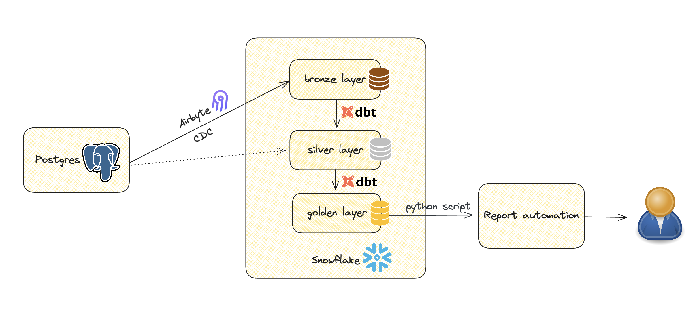

## Data Engineering Take-Home Task
This repository contains all the scripts and configurations to set up the four services in our analytics platform:
- **db_setup**: Sets up a local PostgreSQL database with sample data.
- **ingestion**: Manages data ingestion from PostgreSQL to Snowflake.
- **transformation**: Handles data modeling in Snowflake using dbt.
- **report_automation**: Automatically generates reports using data from Snowflake.

### Structure of the analytics platform


In this setup, Snowflake serves as our data warehouse and analytics platform. Airbyte, configured with Change Data Capture (CDC), synchronizes data from PostgreSQL to Snowflake's bronze layer. dbt then transforms this data from the bronze layer to the silver and gold layers within Snowflake. Finally, reports are generated from the gold layer and delivered to end users.

### Setup
Requirements:
* `python == 3.11` (Make sure it's available as `python3.11`)
* `Docker Desktop >= 4.6.0` ([Docker Desktop](https://docs.docker.com/desktop/))
* `virtualenv`

### Project local environment
Create a virtual environment and set up the development environment:
```bash
make install-dev
. venv/bin/activate
```

### Repository structure
```
deels-data-engineering-take-home
|-- db_setup/           
|   |-- db-script/      # script to initialize the database in postgres
|   | Dockerfile        # 
|-- ingestion/          
    |-- airbyte_sync.py # script to set up airbyte and sync data from postgres to snowflake
|-- transformation/     
    |-- .dbt/profiles   # dbt base profile settings
    |-- models/         # dbt models
    |-- macros/         # dbt macros
    |-- dbt_project.yml # dbt project settings
    |-- run_dbt.sh      # script to run dbt commands in scheduled time
    |-- Dockerfile      
|-- report_automation/  # 
    |-- sql/            # pre-defined business reports
    |-- csv_report.py   # the python script to automatically generate the csv report
| Makefile              # Makefile to wrap more complex statements into one command
| README.md             # This Readme
```


### Run the services
**Important**: Ensure you're in the project's root directory before executing the following commands.
- To run all services together:
```bash
make docker-compose-up
```
**Note**: The db_setup configuration has been adjusted in `docker-compose.yaml` to address compatibility issues with the Mac M1 chip. If you encounter errors, please revert to the original configuration.

Additionally, the `ingestion` service isn't fully dockerized (as pyairbyte requires Docker-in-Docker), and `report_automation` currently can't send files to the host machine's path.

Therefore, it's recommended to run the services separately.
- **Run ingestion**
```bash
make run-ingestion-local
```
- **Run transformation**
```bash
make run-transformation-local
``` 
Or, using a Docker container:
```bash
make docker-run service=transformation
```
- **Run report_automation**
```bash
make run-report-automation-local
``` 
Or, using a Docker container:
```bash
make docker-run service=report_automation
```
### Connect to Snowflake
While PostgreSQL is suggested as the analytics database in the task file, it isn't ideal as a data warehouse in real case. Therefore, a trial Snowflake account has been set up for this purpose.
Various roles and warehouses have been created for different tasks:
- **AIRBYTE_ROLE**: Used by `Airbyte` to sync data from PostgreSQL to Snowflake.
- **REPORT_ROLE**: Used by `report automation` to read data from Snowflake.

Due to time constraints, a service role for `transformation` hasn't been set up yet.

To log in to Snowflake, use the following credentials:

- **account**: `BUTEFLJ-DH94720`
- **user**: `CLAUDIADEEL`
- **password**: `1234claudiaDeal`


### Limitations and Todos
- Airbyte Setup:
  - Setting up Airbyte proved more challenging than anticipated. Despite extensive debugging, it isn't functioning perfectly.
  - Pyairbyte requires Docker-in-Docker. With the current Dockerfile, the daemon runs in a Docker container, but encounters the error: `AirbyteConnectorCheckFailedError: Connector check failed.
    Please review the log file for more information.
    More info: https://docs.airbyte.com/integrations/sources/postgres
    Connector Name: 'source-postgres'
    Failure Reason: 'Could not connect with provided configuration. Error: java.nio.file.NoSuchFileException: /airbyte/tmp/tmpusrlcr_m.json'`. 
    This indicates an issue with temporary file generation.
  - Attempted to run the Airbyte server locally following the [official setup documentation](https://docs.airbyte.com/using-airbyte/getting-started/oss-quickstart), but it didn't function properly.
  - The `destination-snowflake` connector had issues with case-sensitive schema and table names. As a workaround, used the SnowflakeCache to sync data from PostgreSQL to Snowflake. While functional, it appears that unchanged data is being re-synced. Time constraints prevented further investigation.
  - The initial plan was to use Airbyte to obtain both historical and current state data in Snowflake. Currently, only changelogs are being captured, with dbt used to derive current state tables. Capturing changelogs is crucial for building SCD2 tables in the future.
- No proper scheduler set up. No proper scheduler has been set up. Both ingestion and transformation have dependencies but are currently scheduled in a simplistic manner.
- Real-time processing:
  - The platform currently has a 10-minute latency, falling short of true real-time processing.
  - Achieving real-time processing requires a robust ingestion tool (either kafka or no-code tool like Fivetran, stitch etc.) to stream PostgreSQL CDC data to Snowflake.
  - For real-time analytics, creating a view on top of the silver layer (or changelogs + silver layer) with business logic and smart filters is necessary. Additionally, tables need proper optimization.
- No proper secret management.
- No ci-cd and testing.
- No data quality check.
  - There might be a bug in the db-setup: although there are non-completed (open) orders in table order, it doesn't have matching records in the order_items table. Therefore, the report I'm getting with granularity on order_items, no open orders at all.
- No IaC for Snowflake.